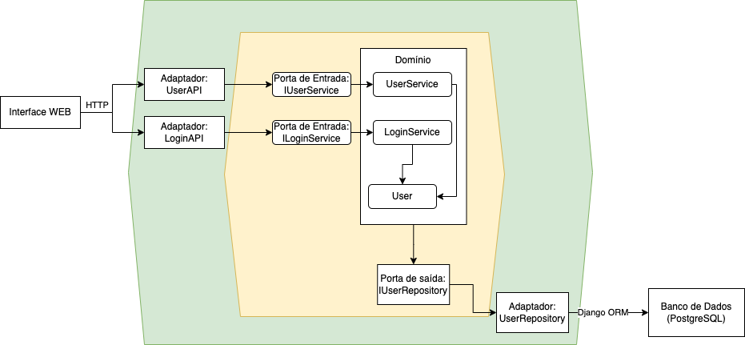
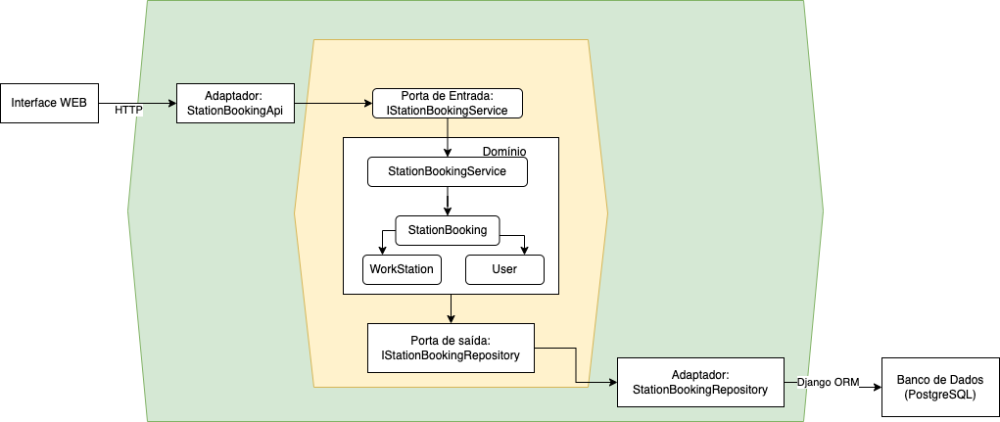

# PreWork

Sistema de gerenciamento de espaços de trabalho compartilhados e de agendamento da utilização de estações de trabalho.

Projeto desenvolvido para a disciplina Prática em Desenvolvimento de Software 2022/1 da UFMG.

## Equipe

- Eduardo de Paiva Dias - Desenvolvedor de Software Frontend
- Fernanda Rocha de Morais Gonçalves - Desenvolvedora de Software Fullstack
- Luis Fernando Camargos Carvalho - Desenvolvedor de Software Frontend
- Paula Mara Ribeiro - Desenvolvedora de Software Fullstack
- Victor Gabriel Ferreira Moraes - Desenvolvedor de Software Fullstack

## Escopo

O PreWork é uma solução web para coworkings e escritórios realizarem o gerenciamento virtual de suas mesas compartilhadas, de forma a permitir que seus usuários reservem mesas de forma fácil e prática.

Suas principais funcionalidades incluem:

- Gestão de estações de trabalho e salas de reunião (adicionar, editar, deletar e listar)
- Realização de reservas de estação de trabalho ou salas

## Tecnologias

- Frontend: Typescript, com auxílio da biblioteca React
- Backend: Python utilizando o framework de desenvolvimento web Django
- Banco de dados: Postgresql e Django ORM

## MVP

Com a pandemia do Covid-19, diversas empresas adotaram um regime remoto ou híbrido, o que causou o crescimento da procura por coworkings por parte dos funcionários e necessidade de gerenciamento do espaço de escritórios para empresas híbridas.

Essas empresas com escritórios híbridos e coworkings realizam um trabalho manual para gerir usuários e agendamentos de mesas e salas de reuniões, muitas vezes de maneira informal (por chats ou formulários próprios) que serão processados manualmente, causando uma sobrecarga no time de operações e recursos humanos. Porém, a hipótese do PreWork é que elas não gostariam de ter esse gasto e estariam dispostas a contratar um serviço para resolver o problema por elas.

Para a validação do PreWork, decidimos realizar um MVP Mágico de Oz, em que será disponibilizado um formulário simples para os usuários realizarem as requisições de locação de sala de reunião ou espaço de trabalho, que serão processadas manualmente pela nossa equipe, de forma a remover o esforço operacional da empresa ou coworking.

O MVP será disponibilizado para poucas unidades de empresas híbridas e poucas unidades de coworkings, o que nos permitirá validar a nossa hipótese, assim como compreender quais as maiores necessidades de cada um dos dois tipos de cliente e quanto interesse eles apresentam à solução fornecida.

## Protótipo

Protótipo disponível no [Figma](https://www.figma.com/file/KKFnCoqbvlcWkHjRBEAtyd/Prework).

## Backlog da Sprint

Na primeira sprint do PreWork, temos como objetivo lançar uma versão inicial funcional do projeto. Para isso, focaremos nas tarefas essenciais para seu lançamento: tarefas técnicas de configuração, acesso do cliente à plataforma e a funcionalidade de reserva de estação de trabalho por dia.

Assim, tarefas como gestão de usuários e gestão de estações de trabalho continuarão sendo feitas manualmente pela equipe do PreWork. A funcionalidade de salas de reunião será priorizada em uma iteração futura.

### Tarefas técnicas

- Fazer setup do projeto de backend em Django. (Fernanda)
- Criar docker para projeto de backend. (Paula)
- Fazer setup do projeto de frontend em React. (Luís)

### Acesso

- **Como** usuário do PreWork, **quero** realizar login.
  - Tarefa 1: Criar tabela de usuário no banco de dados. (Fernanda)
  - Tarefa 2: Criar recurso de login. (Paula)
  - Tarefa 3: Criar página de login. (Luís)
  - Tarefa 4: Criar página inicial de cliente. (Eduardo)

### Reserva de estações de trabalho

- **Como** usuário do PreWork, **quero** filtrar por dia as estações de trabalho disponíveis em uma sala.

  - Tarefa 1: Implementar página de reserva de estações de trabalho. (Eduardo)
  - Tarefa 2: Implementar página de salas indisponíveis. (Luís)
  - Tarefa 3: Criar tabela para sala de estações de trabalho. (Paula)
  - Tarefa 4: Criar tabela de estações de trabalho. (Victor)
  - Tarefa 5: Criar tabela de reservas de estações de trabalho. (Fernanda)
  - Tarefa 6: Criar endpoint para retornar a disponibilidade das estações de trabalho na sala e dia pesquisados. (Victor)

- **Como** usuário do PreWork, **quero** reservar estações de trabalho **para** que eu possa trabalhar presencialmente em um local específico.

  - Tarefa 1: Implementar página de reserva de estações de trabalho. (Eduardo)
  - Tarefa 2: Criar endpoint para reserva de estação de trabalho. (Paula)

## Backlog do Produto

Backlog de tarefas disponível também no [Trello](https://trello.com/b/FBUHFzwk/pds-prework).

### Gestão de usuários

- **Como** usuário administrador, **quero** cadastrar um novo usuário.
- **Como** usuário administrador, **quero** administrar os usuários com acesso ao escritório.
- **Como** usuário administrador, **quero** deslogar do PreWork.

### Reserva de salas

- **Como** usuário do PreWork, **quero** filtrar por horário as salas de reunião disponíveis.
- **Como** usuário do PreWork, **quero** reservar salas de reunião **para** que eu e outros colegas possam trabalhar presencialmente em um local específico.
- **Como** usuário do PreWork, **quero** gerenciar uma reserva realizada (visualizar minhas reservas, editar ou excluir.)

### Reserva de estações de trabalho

- **Como** usuário do PreWork, **quero** gerenciar uma reserva realizada (visualizar minhas reservas, editar ou excluir.)

### Gerenciamento de estações de trabalho

- **Como** usuário administrador, **quero** cadastrar salas de estações de trabalho **para** que os clientes possam reservá-las.
- **Como** usuário administrador, **quero** editar e deletar salas de estações de trabalho **para** manter os dados das salas atualizados.
- **Como** usuário administrador, **quero** visualizar uma listagem das salas de estações de trabalho existentes **para** facilitar o gerenciamento das salas.
- **Como** usuário administrador, **quero** cadastrar estações de trabalho **para** que eu possa adicioná-las a uma sala.
- **Como** usuário administrador, **quero** associar estações de trabalho a uma sala **para** que os clientes possam reservar os assentos desejados.
- **Como** usuário administrador, **quero** visualizar todas as reservas de estações de trabalho realizadas.

### Gerenciamento de salas de reunião

- **Como** usuário administrador. **quero** cadastrar salas de reunião **para** que os clientes possam reservá-las .
- **Como** usuário administrador, **quero** editar e deletar salas de reunião **para** manter os dados das salas atualizados.
- **Como** usuário administrador, **quero** visualizar uma listagem das salas de reunião existentes **para** facilitar o gerenciamento das salas.
- **Como** usuário administrador, **quero** visualizar os detalhes de uma sala de reunião **para** verificar os dados cadastrados.
- **Como** usuário administrador, **quero** visualizar todas as reservas de salas de reunião realizadas.

## Arquitetura do Backend

### Arquitetura Hexagonal

O sistema está adotando a arquitetura hexagonal porque ela favorece a utilização de boas práticas de programação, em especial o baixo acoplamento e independência da tecnologia.
Assim, mantivemos os detalhes tecnológicos, como o Django Rest Framework e o Django ORM completamente segregados do domínio na pasta "adapters", enquanto o domínio está definido na pasta "domain".
Isso aumenta a testabilidade do nosso código e a sua coesão.

Assim, nossa arquitetura foi implementada de acordo com os diagramas abaixo:






Como é posssível observar nos diagramas, temos 4 adaptadores para interfaces web:

- UserAPI
- LoginAPI
- WorkStationRoomAPI
- StationBookingApi

Eles servem para abstrair o framework web utilizado, de forma a permitir que o domínio se comunique independente de ser HTTP, mobile, do formato de entrada ser Json, XML, etc.

Cada um desses adaptadores se comunica com uma porta de entrada, que definem interfaces para a comunicação com o domínio para que os adaptadores sigam, sendo elas respectivamente:

- IUserService
- ILoginService
- IWorkStationRoomService
- IStationBookingService

Nos domínios, possuímos classes de serviço e entidades que serão explorados mais a fundo na seção seguinte.

No domínio, temos também algumas portas de saída, que servem para abstrair a comunicação com o banco de dados. São elas:

- IUserRepository
- IWorkStationRoomRepository
- IStationBookingRepository

Cada uma delas é implementada por um repositório correspondente, responsável por realizar a comunicação com o banco de dados PostgreSQL a partir da utilização do DjangoORM e depois transformar o model do Django em uma entidade de domínio. Assim, nosso domínio não é poluído com o conceito de "model" do Django ou nenhum outro detalhe tecnológico.

Todas essas funcionalidades são definidas por injeção de dependências. Na definição de urls (em urls.py) injetamos a implementação dos repositories e services da seguinte maneira:

```
user_repository = UserRepository()
login_service = LoginService(repository=user_repository)
user_service = UserService(repository=user_repository)

work_station_room_repository = WorkStationRoomRepository()
work_station_room_service = WorkStationRoomService(repository=work_station_room_repository)

station_booking_repository = StationBookingRepository()
station_booking_service = StationBookingService(
  bookings_repository=station_booking_repository,
  rooms_repository=work_station_room_repository
)
```

Isso nos permite manter a barreira de anticorrupção intacta.

### Domain Driven Design

Para o desenvolvimento da aplicação, buscamos aplicar o conceito de linguagem ubíqua, portanto utilizamos termos comuns no âmbito de coworkings, como 'work station', 'station room' e 'booking' para reservas.
Isso possibilita uma comunicação natural com stakeholders e a manutenção da congruência do código.

No nosso projeto, temos algumas entidades: a WorkStation, a WorkStationRoom e o User.

Nós utilizamos também um objeto de valor muito importante: o datetime, da biblioteca datetime.
Por lidarmos com agendamento de estações de trabalho, é essencial que tenhamos a informação de quando determinada estação está ocupada.

Temos também um agregado, a classe StationBooking. Ela possui um usuário (uma entidade) a data de agendamento (um objeto de valor) e uma work station (também uma entidade), de forma a representar o agendamento de uma estação de trabalho em um determinado dia por um usuário.

Ainda no domínio, implementamos os seguintes serviço:

- UserService
- LoginService
- WorkStationRoomService
- StationBookingService

Esses serviços realizam operações importantes de domínio a partir de métodos e são stateless. Eles utilizam dos repositórios a seguir para persistir os resultados de suas operações:

- UserRepository
- WorkStationRoomRepository
- StationBookingRepository

Conforme explicado na seção de arquitetura hexagonal, os repositórios são adaptadores que abstraem o acesso ao banco de dados, e são usados para recuperar entidades e agregados.
